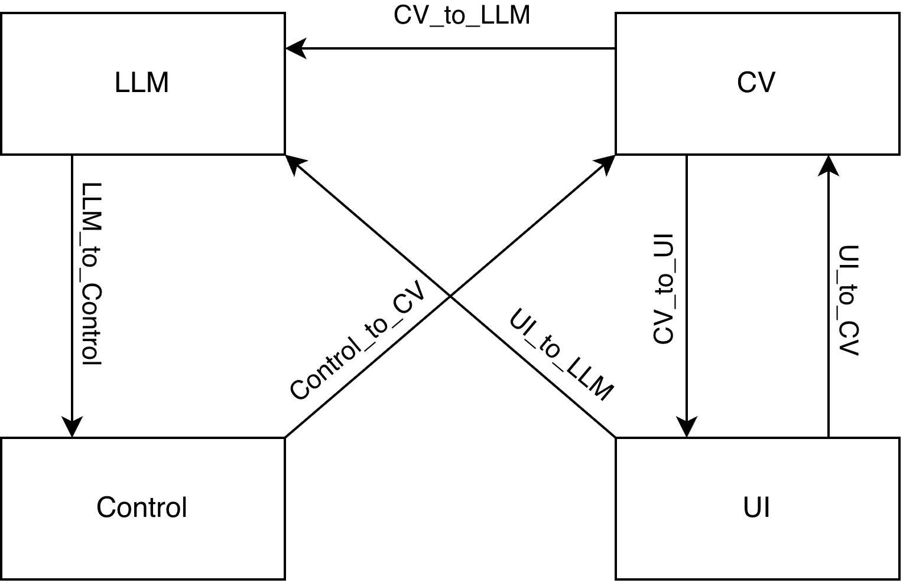

# Robot Playing Mastermind

This repository contains code and assets for a two-player (and player-vs-robot) implementation of the Mastermind-like game where a robot physically picks and places colored pieces, and vision + language models help evaluate and/or choose guesses.


## Overview

1. Player chooses a secret color combination of four game pieces.
2. The robot makes guesses (color + position) driven by analysis from the ChatGPT API.
3. A camera system (YOLO-based detector) inspects the robot’s placement and determines whether the guess is correct; the system feeds the results back for the next decision.


## Features

* Physical robot arm control for picking & placing colored pieces.
* Human-in-the-loop gameplay (PVP).
* Autonomous robot guessing using a ChatGPT-powered strategy (PVE).
* Visual verification using a YOLO object-detection model and camera.

Repository structure (suggested)
```graphsql
/ (root)
├─ README.md
├─ src/
│  ├─ robot_control/        # robot control code & SDK wrappers
│  ├─ vision/               # YOLO model, detection scripts, camera interface
│  ├─ llm/                  # ChatGPT API interface & decision logic
│  ├─ ui/                   # control scripts / CLI / GUI
│  └─ utils/
├─ models/                  # trained vision model weights
├─ assets/                  # diagrams, photos, sample configs
└─ docs/                    # setup, wiring diagrams, experiment notes
```


## How to run
Step1. login using github.

```bash
ssh-keygen -t ed25519 -C "your_example@example"
ssh-add ~/.ssh/id_ed25519
```

Step2. Build docker:
```bash
docker build -t mastermind:latest .
```

Step3. Start docker:
```bash
# Allow Docker to open GUI Windows
xhost +local:docker

docker run --rm -it   \
-v "$PWD:/root/workspaces" \
-e HOME=/root/ \
-e DISPLAY=$DISPLAY \
--net=host \
--gpus all \
--name mastermind   \
mastermind:latest
```

For commands to run in the Docker environment, go [here](https://github.com/Antony957/RobotPlayingMastermind/tree/combine/mastermind_ws).

## Data Flow 

1. The user inputs target state at UI, UI model initilize the target combination (at simiulation). Or: The user put target state at detection area (in real world). After finished, UI model send a mark to CV model.

2. CV model extract target state from detection area. After finished, CV send a mark to LLM model.

3. 
    ```
    do {
        1. LLM guess a combination based on history guess;
        2. LLM send message to Control Model;
        3. After control finished, send a mark to CV;
        4. CV extract current state and send it to UI;
        5. UI send a result (win or not) to LLM.
    } while (!win)
    ```

## Structure




## License 
This project is released under the MIT License — see LICENSE for full text.

